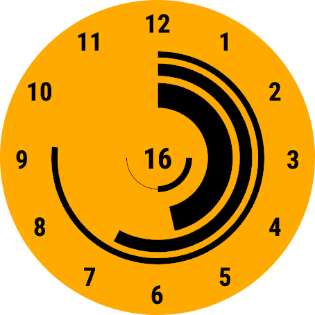

# LxF Arcs

A watch face for Garmin devices. Minimalist, circular, customisable.

## Features

- Customisable colours, seconds display, battery indicator, date display
- Customisable between filled arcs and cutout circles

## Legend

- Outermost arc: Seconds (can be disabled)
- Middle arc: Minutes
- Innermost arc: Hours
- Central number: Day of the month (can be disabled)
- Central semi-circle: Battery indicator (can be disabled)

## Settings

- Background Color: The colour of the background
- Foreground Color: The colour of the arcs and text
- Show Seconds: If the outermost arc showing seconds should be shown
- Show Date: If a number representing the day of the month should be shown
- Show Battery: If the battery indicator should be shown
- Numeric Hour Marks: Shows numbers at the hour positions
- Cutout Mode: If true, circles with a small notch will be used instead of
  filled arcs

<h2>Developer Documentation</h2>

## Preparing a release

To perform a release:

- Create an entry in [CHANGELOG.md](CHANGELOG.md) under the next version
- Update README.md with features / screenshots
- Update the version number for `AppVersion` in
  [resources/strings.xml](resources/strings.xml).
- Commit with `Version x.x.x`
- Tag that commit as `vx.x.x`

